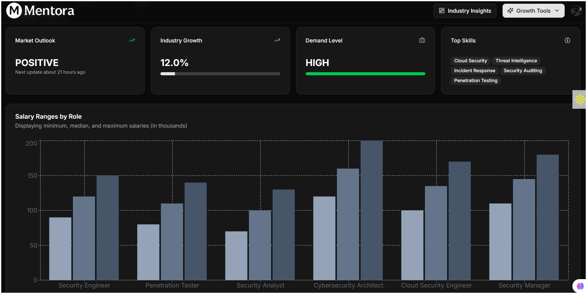

# 🎓 Mentora – Your AI Career Coach

Mentora is an intelligent career assistant that helps users **build professional resumes**, **generate personalized cover letters**, and **prepare for interviews** – all powered by **Gemini AI**. With a sleek UI, real-time feedback, and smart data flows, Mentora empowers users to confidently take the next step in their career journey.

## 🚀 Features

### 👤 User Features

* **AI Resume Builder** – Create ATS-friendly resumes using AI assistance.
* **Cover Letter Generator** – Personalized letters based on job role, experience & tone.
* **Interview Preparation** – Take quizzes and receive smart feedback using Gemini API.
* **Progress Dashboard** – Visualize your activity, performance, and growth.
* **Auth System** – Secure sign-up/sign-in with session management.

### ⚙️ Tech Features

* **Data Fetched from API** – All resume, letter, and quiz content powered by API responses.
* **Job-Ready UI** – Built with modern design principles using ShadCN.
* **Event Workflows** – Background actions handled using Inngest.
* **Cloud PostgreSQL** – Database hosted on Neon DB for reliability and speed.

---

## 🛠️ Tech Stack

### 🧠 AI

* **Gemini API** – Google’s generative model for text-based career content.

### 🌐 Frontend

* **Framework**: Next.js (App Router)
* **UI Kit**: ShadCN UI (Radix + Tailwind CSS)
* **Routing**: File-based routing in Next.js
* **State Handling**: React Hooks & API calls
* **Charts & Visuals**: Chart.js (for interview analytics)

### 🖙 Backend & Infra

* **Database**: PostgreSQL (Neon DB)
* **ORM**: Prisma
* **Auth**: Clerk (User management & JWT auth)
* **Event Workflows**: Inngest

---

## 📅 Installation

### 🔧 Prerequisites

* Node.js + npm
* PostgreSQL DB (Neon DB preferred)
* Gemini API Key
* Clerk Project Setup
* Inngest Account

---

### 📦 Setup & Run

```bash
git clone https://github.com/your-username/mentora.git
cd mentora
npm install
cp .env.example .env    # Add your environment variables
npx prisma generate
npx prisma db push
npm run dev
```

---

## 📸 Screenshot[Dashboard]



---

## 🤝 Contributing

Contributions are welcome! Feel free to fork the repo and submit a pull request.

---

## 📜 License

MIT License © 2025 Kanhaiya Mandal
